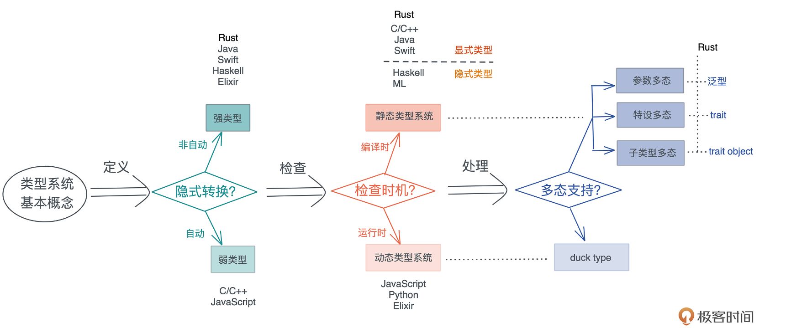

## 类型
### 类型系统

### 大小

## trait
Rust中Vector之类的必须是同种类型，因此需要转化为trait object再动态分发.

### Trait object

如果 trait 所有的方法，返回值是 Self 或者携带泛型参数，那么这个 trait 就不能产生 trait object。
- 不允许返回 Self，是因为 trait object 在产生时，原来的类型会被抹去，所以 Self 究竟是谁不知道。比如 Clone trait 只有一个方法 clone()，返回 Self，所以它就不能产生 trait object。
- 不允许携带泛型参数，是因为 Rust 里带泛型的类型在编译时会做单态化，而 trait object 是运行时的产物，两者不能兼容。

- extension trait
- associate trait
- generic trait
- super trait
- trait composition

### [必须掌握的Trait](https://learn.lianglianglee.com/%e4%b8%93%e6%a0%8f/%e9%99%88%e5%a4%a9%20%c2%b7%20Rust%20%e7%bc%96%e7%a8%8b%e7%ac%ac%e4%b8%80%e8%af%be/14%20%e7%b1%bb%e5%9e%8b%e7%b3%bb%e7%bb%9f%ef%bc%9a%e6%9c%89%e5%93%aa%e4%ba%9b%e5%bf%85%e9%a1%bb%e6%8e%8c%e6%8f%a1%e7%9a%84trait%ef%bc%9f.md)

### Reference
- [async-prost](https://github.com/tyrchen/async-prost)
- [all-about-trait-object](https://brson.github.io/rust-anthology/1/all-about-trait-objects.html)
- [Generics- Rust by example](https://doc.rust-lang.org/beta/rust-by-example/generics.html)
- [Generic Types, Traits, and Lifetimes - Rust doc](https://doc.rust-lang.org/book/ch10-00-generics.html)
- [Trait Object by comprehensive Rust](https://google.github.io/comprehensive-rust/methods-and-traits/trait-objects.html)
- [Extension trait](https://rust-lang.github.io/rfcs/0445-extension-trait-conventions.html)