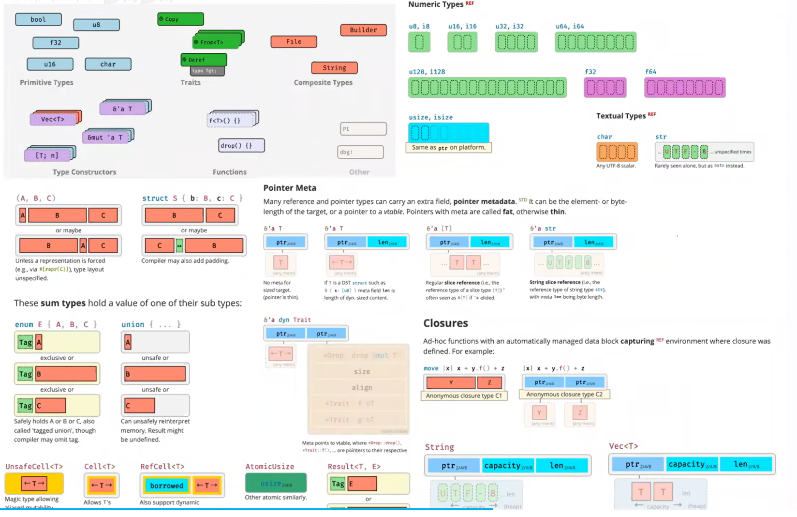
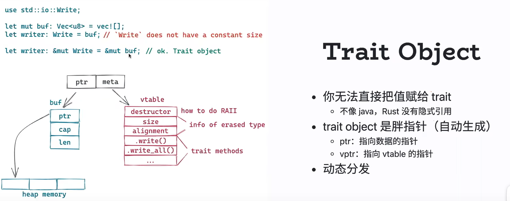
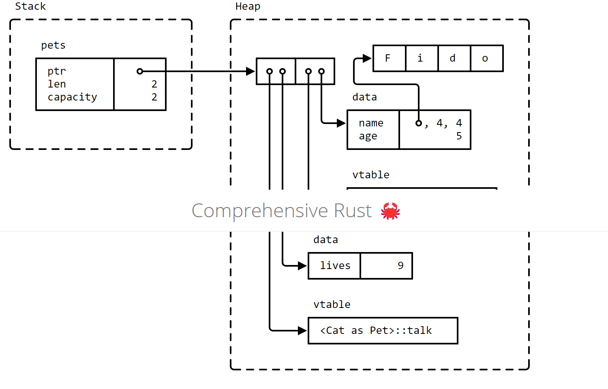

## 类型

## trait
Rust中Vector之类的必须是同种类型，因此需要转化为trait object再动态分发.

### Trait object

- extension trait
- associate trait
- generic trait
- super trait
- trait composition

### Reference
- [async-prost](https://github.com/tyrchen/async-prost)
- [all-about-trait-object](https://brson.github.io/rust-anthology/1/all-about-trait-objects.html)
- [Generics- Rust by example](https://doc.rust-lang.org/beta/rust-by-example/generics.html)
- [Generic Types, Traits, and Lifetimes - Rust doc](https://doc.rust-lang.org/book/ch10-00-generics.html)
- [Trait Object by comprehensive Rust](https://google.github.io/comprehensive-rust/methods-and-traits/trait-objects.html)
- [Extension trait](https://rust-lang.github.io/rfcs/0445-extension-trait-conventions.html)